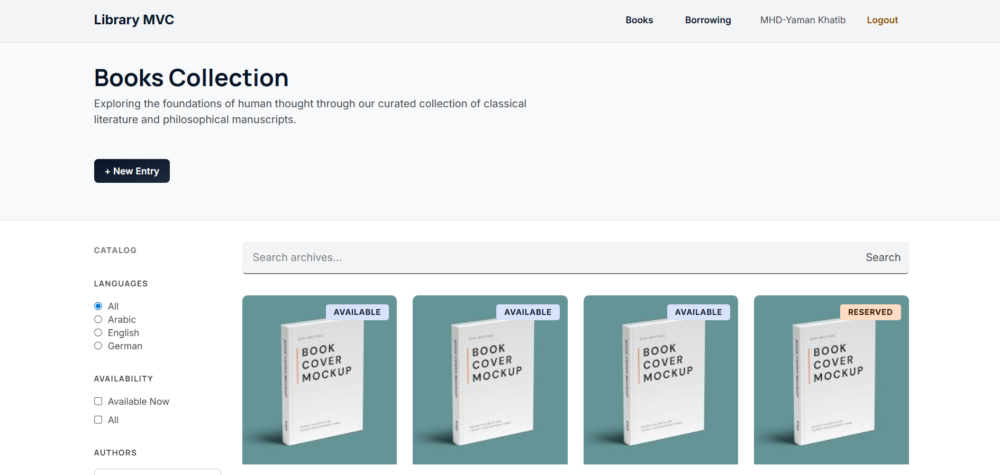

# Library MVC

Library MVC is a layered ASP.NET Core MVC application for managing a small library catalog and a borrowing workflow. It is designed as a company style assignment with a clean separation between the Web layer (MVC), Business layer (services), and Data Access layer (ADO.NET repositories).

## Roles and access

The application uses cookie based authentication and role based authorization.

### User

- Browse the books catalog (search, filter, pagination)
- View book details
- Borrow available books
- View personal borrowings
- Return active borrowings

### Admin

- Everything a user can do
- Create new books (catalog entries)
- Update and delete books (when implemented in the UI)

## Main features

- Cookie authentication with secure cookie settings
- Books catalog
  - Search
  - Language and author filters
  - Pagination
  - Details page
- Borrowing workflow
  - Borrow a book from the books list
  - My Borrowings screen grouped by Active and Returned
  - Return a borrowed book
- Layered architecture
  - Controllers are thin and use services
  - Services orchestrate repositories and enforce rules
  - Repositories use ADO.NET and parameterized SQL

## Tech stack

- .NET SDK 9 (see `global.json`)
- ASP.NET Core MVC
- ADO.NET (no ORM)
- SQL Server 2019
- Tailwind CSS (local build via CLI)

## Architecture overview

- `Library.Web`
  - MVC controllers, Razor views, and ViewModels
  - Handles HTTP concerns, model binding, and rendering
- `Library.BL`
  - Business services, DTOs, entities, and result types
  - Contains business rules and orchestration
- `Library.DAL`
  - Repositories and database access via ADO.NET
  - Uses a connection factory and parameterized SQL

## Setup and prerequisites

### Prerequisites

- .NET SDK 9
- SQL Server 2019 (SSMS recommended)
- Node.js and npm (only required for Tailwind local build)

### Database setup (SQL Server 2019)

The repository includes database assets under `Database/`:

- `Database/LibraryDB.bak` (backup file)
- `Database/libraryDb.sql` (SQL script)

Choose one of the following:

Option A: Restore from backup

1. Open SQL Server Management Studio (SSMS)
2. Right click Databases, then Restore Database
3. Select Device, choose `Database/LibraryDB.bak`, then restore

Option B: Run the SQL script

1. Open `Database/libraryDb.sql` in SSMS
2. Execute the script against your SQL Server instance

### Configure the connection string

The Web project reads the `LibraryDb` connection string from:

- `Library.Web/appsettings.json`

Update it to match your SQL Server instance if needed. Example:

`Server=.;Database=LibraryDB;Trusted_Connection=True;TrustServerCertificate=True;`

### Restore and run the application

From the repository root:

1. Restore .NET packages
   - `dotnet restore`
2. Build Tailwind CSS (see Tailwind section)
3. Run the Web app
   - `dotnet run --project Library.Web/Library.Web.csproj`

## Tailwind CSS (local build)

This project uses a local Tailwind build. Tailwind is compiled into:

- `Library.Web/wwwroot/css/tailwind.css`

The source input is:

- `Library.Web/Styles/tailwind.css`

Install npm dependencies once:

- `npm install`

Build the CSS once:

- `npm run build:css`

Watch and rebuild automatically while developing:

- `npm run watch:css`

When you change Tailwind classes in Razor views, re run the build or keep the watcher running.

## Usage

- Browse books at `/Books`
- Login at `/Auth/Login` there is a seeded admin in the Database/libraryDb.sql
- Use : email: `admin@example.com` and password: `password`
- Borrow an available book from the books list (requires authentication)
- View personal borrowings at `/Borrowings` (requires authentication)

## Security notes

- Authentication uses secure cookies (`SecurePolicy=Always`, `HttpOnly=true`)
- Sensitive POST actions use antiforgery tokens
- Role based authorization restricts admin only actions

## Feature enhancement plan

Planned improvements to evolve this assignment into a more complete system:

- Admin user management
  - Allow admins to create other admins
  - Promote existing users to admin
- Fine grained permissions
  - Introduce permissions beyond the Admin or User role
  - Example: CatalogWrite, BorrowingWrite, UserAdmin
- Book cover images
  - Upload and store cover images instead of using a default asset
- Improved validations and UX
  - Better error messages, inline validations, and confirmation flows
- Testing and CI
  - Add unit tests for services and integration tests for repositories
  - CI pipeline to run build and tests automatically

